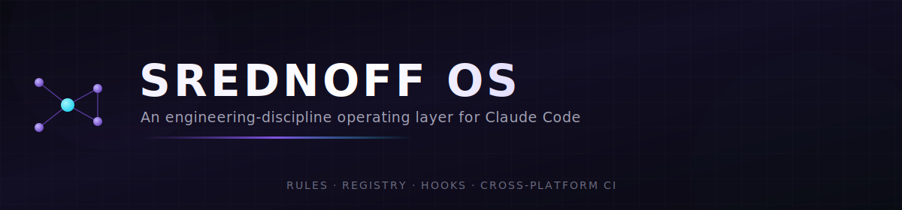
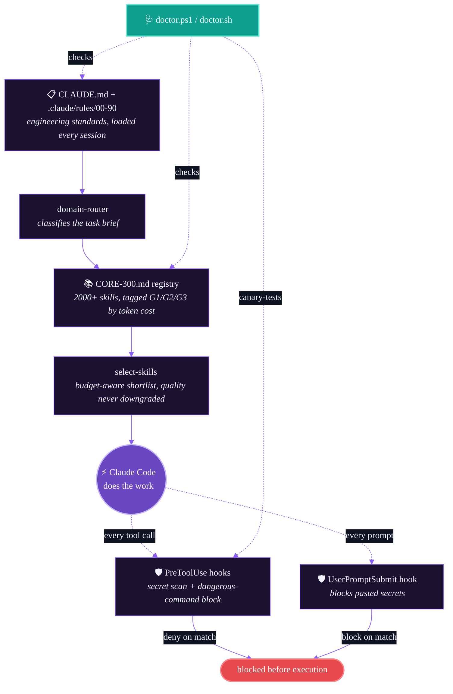

<div align="center">



<br><br>

[](LICENSE)
[](https://github.com/srednoff888-art/srednoff-os-for-claude/actions/workflows/ci.yml)
[](https://claude.com/claude-code)
[](registry/CORE-300.md)
[](https://github.com/srednoff888-art/srednoff-os-for-claude/pulls)

<sub>

[Quick start](#quick-start) &nbsp;•&nbsp; [How it works](#how-it-works) &nbsp;•&nbsp; [What's inside](#whats-inside) &nbsp;•&nbsp; [Release evidence](#release-evidence) &nbsp;•&nbsp; [Security](#security-hooks-are-opt-in-on-purpose) &nbsp;•&nbsp; [Русская версия ↓](README.ru.md)

</sub>

</div>

<br>

## The problem

Claude Code is extremely capable out of the box — but every session starts from a blank slate. It re-decides your engineering standards each time, has no memory of which skill actually helped last time, and has no safety net if it (or you) types something dangerous into a terminal.

**SREDNOFF OS is a layer of files that fixes that** — rules it follows, a registry of 2000+ skills it picks from, and hooks that stop it before it leaks a secret or runs `rm -rf`.

<table width="100%">
<tr>
<th align="left" width="26%"></th>
<th align="left" width="37%">Vanilla Claude Code</th>
<th align="left" width="37%">+ SREDNOFF OS</th>
</tr>
<tr>
<td><strong>Engineering standards</strong></td>
<td>🔴 Re-decided every session</td>
<td>🟢 Loaded from <code>CLAUDE.md</code> + 10 rule files on every start</td>
</tr>
<tr>
<td><strong>Skill selection</strong></td>
<td>🔴 Whatever the model happens to reach for</td>
<td>🟢 Scored shortlist from a 2000+ entry registry, budget-aware</td>
</tr>
<tr>
<td><strong>Pasted secrets</strong></td>
<td>🔴 No built-in stop</td>
<td>🟢 Denied before the prompt is even submitted</td>
</tr>
<tr>
<td><strong>Dangerous commands</strong><br><sub><code>rm -rf</code>, <code>mkfs</code>, force-push…</sub></td>
<td>🔴 No built-in stop</td>
<td>🟢 Denied before the tool executes</td>
</tr>
<tr>
<td><strong>Installable skills</strong></td>
<td>🔴 Manual, one at a time</td>
<td>🟢 303 curated skills auto-installed by project tags, capped for context budget</td>
</tr>
<tr>
<td><strong>Health check</strong></td>
<td>🔴 None</td>
<td>🟢 One command — structure, evals, registry audit, live hook canary</td>
</tr>
<tr>
<td><strong>Cross-platform</strong></td>
<td>⚪ N/A</td>
<td>🟢 Full parity  Windows /  Linux /  macOS — CI-verified down to bash 3.2</td>
</tr>
</table>

<br>

## 🩻 How it works



<br>

## 📦 What's inside

<table width="100%">
<tr><th align="left" width="42%">Path</th><th align="left">Contents</th></tr>
<tr><td><code>CLAUDE.md</code>, <code>AGENTS.md</code>, <code>code_review.md</code></td><td>The core rulebook</td></tr>
<tr><td><code>.claude/rules/00-90</code></td><td>10 numbered rule files — skill selection, model routing, subagent contract…</td></tr>
<tr><td><code>.claude/skills/</code></td><td>Reusable base skill definitions</td></tr>
<tr><td><code>.claude/commands/</code></td><td>Slash commands</td></tr>
<tr><td><code>.claude/hooks/</code></td><td>PowerShell + Bash hooks — secret scanning, dangerous-command blocking</td></tr>
<tr><td><code>.agent/</code></td><td>Agent-facing conventions + the multi-stage checkpoint process</td></tr>
<tr><td><code>scripts/</code></td><td>Install, doctor, profile-lock generator, eval runner, source ranker</td></tr>
<tr><td><code>skills-library/</code></td><td><strong>303 installable skills</strong> — auto-selected per project, capped for context budget</td></tr>
<tr><td><code>registry/CORE-300.md</code></td><td>2000+ skills/agents, tagged and tiered</td></tr>
<tr><td><code>registry/SELECTION-PROTOCOL.md</code></td><td>How to pick skills for a project without loading the whole catalog</td></tr>
<tr><td><code>registry/CAPABILITY-INDEX.md</code></td><td>One canonical pick per capability — no overlap confusion</td></tr>
<tr><td><code>registry/evals/</code></td><td>Fixtures that catch regressions in routing and secret detection</td></tr>
<tr><td><code>docs/</code></td><td>Architecture, security, workflows, and validation reference</td></tr>
<tr><td><code>benchmarks/</code></td><td>Reproducible control-vs-OS benchmark harness</td></tr>
<tr><td><code>scripts/global/</code></td><td>Optional global SessionStart hook + statusline (opt-in)</td></tr>
</table>

<br>

## 🚀 Quick start

### Option A — as a Claude Code plugin <sup>(fastest, macOS/Linux)</sup>

Two commands, no file copying, no manual `settings.json` editing:

```
/plugin marketplace add srednoff888-art/srednoff-os-for-claude
/plugin install srednoff-os
```

> The plugin ships **disabled** (`defaultEnabled: false`) — its hooks can block tool calls, so you turn them on consciously via `/plugin`. Auto-wired hooks target **bash** and need `jq` + `grep -P` in `PATH`. Windows: use the PowerShell wiring in Option B instead (one `hooks.json` can't branch per OS).

### Option B — per-project scripts <sup>(Windows-first, full system)</sup>

Every script exists in two versions with full functional parity:

<table width="100%">
<tr><th align="left" width="26%">Platform</th><th align="left">Requires</th></tr>
<tr><td>🪟 <strong>Windows</strong></td><td>PowerShell 5.1+ — no extra dependencies</td></tr>
<tr><td>🐧🍎 <strong>Linux / macOS</strong></td><td><code>bash</code> 3.2+ (the default macOS shell works), <code>jq</code>, <code>grep -P</code> — see <a href="#notes">notes</a> below</td></tr>
</table>

```powershell
# Windows
& "path\to\srednoff-os\scripts\init-claude-project.ps1" "C:\path\to\your\project"
```
```bash
# Linux / macOS
bash path/to/srednoff-os/scripts/init-claude-project.sh /path/to/your/project
```

This drops the rulebook into your project, generates a `.claude/PROFILE.lock.md` tailored to what it detects (Next.js? Python? trading/backtest code? Amazon FBA?), auto-installs a capped, tag-matched shortlist from the 303-skill library, and never overwrites a `CLAUDE.md` you already have — it backs up and merges instead.

**Health check, anytime:**

```powershell
& "path\to\srednoff-os\scripts\doctor.ps1" -ProjectPath "C:\path\to\your\project" -RunEvals -FixSafe
```
```bash
bash path/to/srednoff-os/scripts/doctor.sh --project /path/to/your/project --run-evals --fix-safe
```

Reports structure status, registry integrity, catalog/skills-library/docs validity, eval pass rate, and a live canary test against your security hooks — then safely repairs anything missing.

<details>
<summary><strong>What it looks like when it's active</strong></summary>

```
$ claude
[SREDNOFF OS: ACTIVE] project='my-app' tags=web,frontend,ai rules=10 loaded PROFILE.lock=cached
Principle #1 (quality first, economy only at equal quality). Rules 00-90 loaded: operating-system,
github-research, connectors, user-briefing, quality-gate, security, exec-plans, skills-registry,
model-routing (G1~Haiku/G2~Sonnet/G3~Opus), subagent-contract. Full skill registry on demand
(~/.claude/registry/CORE-300.md). External agents = unvetted until github-research.
```

</details>

<details>
<summary><strong>Global auto-apply (optional, opt-in)</strong></summary>

<br>

`scripts/global/session-start-hook.{ps1,sh}` and `scripts/global/statusline.{ps1,sh}` can be wired into `~/.claude/settings.json` to auto-detect and announce the OS at the start of every session under a workspace root you control via the `SREDNOFF_OS_ROOT` environment variable (defaults to your home directory if unset). See the hooks' own comments for the exact `settings.json` keys.

</details>

<br>

## 🔒 Security hooks are opt-in, on purpose

Nothing here modifies your global Claude Code settings by default. Hook wiring examples live in `.claude/settings.example.json` — copy the relevant block in yourself once you've read what it does. The registry and rules are safe to drop in immediately; hooks that can block tool calls are something you should consciously turn on.

> ✅ **CI-verified, not just claimed.** Every push runs shellcheck, JSON validation, the full eval suite, a hook canary (feeds each hook known-bad input and requires a block), docs/skills-library validation, a benchmark-script syntax check, and — because macOS ships `/bin/bash` 3.2.57 — a dedicated job that runs the real security hooks inside an official `bash:3.2` container. [See the workflow →](.github/workflows/ci.yml)

<br>

## 📊 Release evidence

| Check | Where it runs | Proves |
|---|---|---|
| `shellcheck` | CI (ubuntu) | Every `.sh` file is portable and correct |
| `windows-powershell` | CI (windows-latest) | PS parse + PSScriptAnalyzer + full suite on the flagship platform |
| `bash-3-2` | CI (Docker `bash:3.2`) | The exact shell macOS ships — not a proxy |
| `hook-canary` + `profile-lock-gate` | CI + `doctor` | Security hooks actually deny/block known-bad input |
| `registry-audit` | CI + `doctor` | 0 duplicate entries across 2000+ records |
| `skills-library` + `docs` | CI + `doctor` | All 303 installable skills and docs are well-formed |
| `run-evals.{ps1,sh}` | CI + `doctor` | Routing/selector/secret-pattern regression suite |

Full check-by-check evidence table (every number backed by a re-runnable command, plus honest "what this does not promise" sections) in [`QUALITY.md`](QUALITY.md) · current release status in [`RELEASE.md`](RELEASE.md) · reproducible control-vs-OS benchmark harness in [`benchmarks/`](benchmarks/).

<br>

## 🎯 The core idea, in one line

> **Quality of the solution comes first. Economy is only a tie-breaker.**
> Every routing rule in this system exists to pick the *right* tool for a task, not the *cheapest* one — cost-awareness only kicks in when two options would deliver the same result.

<br>

## Notes

- On macOS, `grep -P` isn't in the stock BSD `grep`. Run `brew install grep` and set `SREDNOFF_GREP_BIN=ggrep`, or use WSL on Windows-adjacent setups.
- The ~569 non-`INST`/`ANTH` registry entries are an **unvetted discovery surface**, not license-cleared endorsements — see `70-skills-registry.md` for the verification gate before adopting one.
- `model-routing` is advisory guidance for the main session (switch via `/model`) and an actionable per-call parameter for delegated sub-agents — nothing here auto-switches your main session's model.

## Contributing

PRs welcome. CI runs shellcheck, JSON validation, the full eval suite, the hook canary, docs/skills-library validation, and a real bash-3.2 container job on every push — green CI is the bar. See [`.github/workflows/ci.yml`](.github/workflows/ci.yml).

## License

MIT — see [LICENSE](LICENSE). Use it, fork it, strip it down, build on it.

<br>

<div align="center">

 Made by [Ivan Srednoff](https://github.com/srednoff888-art) &nbsp;·&nbsp; [Русская версия](README.ru.md) &nbsp;·&nbsp; [Report an issue](https://github.com/srednoff888-art/srednoff-os-for-claude/issues)

</div>
