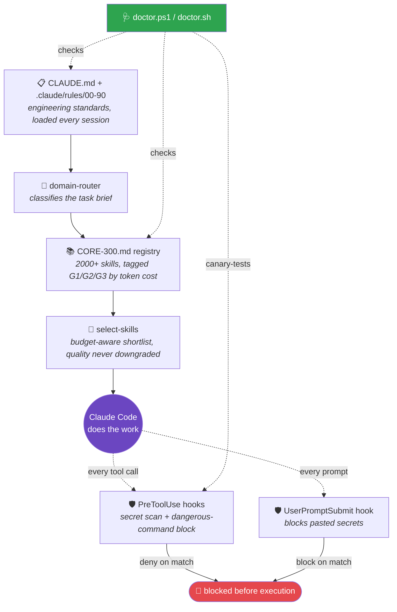

<div align="center">

# 🧠 SREDNOFF OS

### An engineering-discipline operating system for [Claude Code](https://claude.com/claude-code)

Rules it follows. A registry of 2000+ skills it picks from. Hooks that stop it before it leaks a secret or runs `rm -rf`.

[](LICENSE)
[](https://github.com/srednoff888-art/srednoff-os-for-claude/actions/workflows/ci.yml)
[](https://claude.com/claude-code)
[](registry/CORE-300.md)
[](scripts/)
[](https://github.com/srednoff888-art/srednoff-os-for-claude/pulls)

[**Quick start**](#quick-start) · [**How it works**](#how-it-works) · [**What's inside**](#whats-inside) · [Русская версия ↓](README.ru.md)

</div>

<br>

## The problem

Claude Code is extremely capable out of the box — but every session starts from a blank slate. It re-decides your engineering standards each time, has no memory of which skill actually helped last time, and has no safety net if it (or you) types something dangerous into a terminal.

SREDNOFF OS is a layer of files that fixes that.

<table>
<tr><th></th><th>Vanilla Claude Code</th><th>+ SREDNOFF OS</th></tr>
<tr><td><strong>Engineering standards</strong></td><td>Re-decided every session</td><td>Loaded from <code>CLAUDE.md</code> + 10 rule files on every start</td></tr>
<tr><td><strong>Skill selection</strong></td><td>Whatever the model happens to reach for</td><td>Scored shortlist from a 2000+ entry registry, budget-aware</td></tr>
<tr><td><strong>Pasted secrets</strong></td><td>No built-in stop</td><td>Denied before the prompt is even submitted</td></tr>
<tr><td><strong>Dangerous commands</strong> (<code>rm -rf</code>, <code>mkfs</code>, force-push…)</td><td>No built-in stop</td><td>Denied before the tool executes</td></tr>
<tr><td><strong>Health check</strong></td><td>None</td><td>One command: structure + evals + live hook canary</td></tr>
<tr><td><strong>Cross-platform</strong></td><td>N/A</td><td>Full parity Windows / Linux / macOS — CI-verified down to bash 3.2</td></tr>
</table>

<br>

## 🩻 How it works



<br>

## 📦 What's inside

```text
CLAUDE.md, AGENTS.md, code_review.md   the core rulebook
.claude/rules/00-90                    10 numbered rule files — skill selection, model routing, subagent contract...
.claude/skills/                        reusable skill definitions
.claude/commands/                      slash commands
.claude/hooks/                         PowerShell + Bash hooks — secret scanning, dangerous-command blocking
.agent/                                agent-facing conventions
scripts/                               install, doctor, profile-lock generator, eval runner
registry/CORE-300.md                   2000+ skills/agents, tagged and tiered
registry/SELECTION-PROTOCOL.md         how to pick skills for a project without loading the whole catalog
registry/CAPABILITY-INDEX.md           one canonical pick per capability — no overlap confusion
registry/evals/                        fixtures that catch regressions in routing and secret detection
scripts/global/                        optional global SessionStart hook + statusline (opt-in)
```

<br>

## 🚀 Quick start

### Option A — as a Claude Code plugin <sup>(fastest, macOS/Linux)</sup>

Two commands, no file copying, no manual `settings.json` editing:

```
/plugin marketplace add srednoff888-art/srednoff-os-for-claude
/plugin install srednoff-os
```

> The plugin ships **disabled** (`defaultEnabled: false`) — its hooks can block tool calls, so you turn them on consciously via `/plugin`. Auto-wired hooks target **bash** and need `jq` + `grep -P` in `PATH`. Windows: use the PowerShell wiring in Option B instead (one `hooks.json` can't branch per OS).

### Option B — per-project scripts <sup>(Windows-first, full system)</sup>

Every script exists in two versions with full functional parity:

| Platform | Requires |
|---|---|
| **Windows** | PowerShell 5.1+ — no extra dependencies |
| **Linux / macOS** | `bash` 3.2+ (the default macOS shell works), `jq`, `grep -P` — see [notes](#notes) below |

```powershell
# Windows
& "path\to\srednoff-os\scripts\init-claude-project.ps1" "C:\path\to\your\project"
```
```bash
# Linux / macOS
bash path/to/srednoff-os/scripts/init-claude-project.sh /path/to/your/project
```

This drops the rulebook into your project, generates a `.claude/PROFILE.lock.md` tailored to what it detects (Next.js? Python? trading/backtest code? Amazon FBA?), and never overwrites a `CLAUDE.md` you already have — it backs up and merges instead.

**Health check, anytime:**

```powershell
& "path\to\srednoff-os\scripts\doctor.ps1" -ProjectPath "C:\path\to\your\project" -RunEvals -FixSafe
```
```bash
bash path/to/srednoff-os/scripts/doctor.sh --project /path/to/your/project --run-evals --fix-safe
```

Reports structure status, registry integrity, eval pass rate, and runs a live canary test against your security hooks — then safely repairs anything missing.

<details>
<summary><strong>What it looks like when it's active</strong></summary>

```
$ claude
SREDNOFF OS ACTIVE in project 'my-app'. Operating rules: Principle #1 (quality first,
economy only at equal quality); rules 00-90 loaded (github-research, quality-gate,
security, exec-plans, skills-registry, model-routing G1~Haiku/G2~Sonnet/G3~Opus,
subagent-contract). PROFILE.lock [tags: web, frontend, ai]. Full skill registry
available on demand. External agents = unvetted until github-research.
```

</details>

<details>
<summary><strong>Global auto-apply (optional, opt-in)</strong></summary>

<br>

`scripts/global/session-start-hook.{ps1,sh}` and `scripts/global/statusline.{ps1,sh}` can be wired into `~/.claude/settings.json` to auto-detect and announce the OS at the start of every session under a workspace root you control via the `SREDNOFF_OS_ROOT` environment variable (defaults to your home directory if unset). See the hooks' own comments for the exact `settings.json` keys.

</details>

<br>

## 🔒 Security hooks are opt-in, on purpose

Nothing here modifies your global Claude Code settings by default. Hook wiring examples live in `.claude/settings.example.json` — copy the relevant block in yourself once you've read what it does. The registry and rules are safe to drop in immediately; hooks that can block tool calls are something you should consciously turn on.

> ✅ **CI-verified, not just claimed.** Every push runs shellcheck, JSON validation, the full eval suite, a hook canary (feeds each hook known-bad input and requires a block), and — because macOS ships `/bin/bash` 3.2.57 — a dedicated job that runs the real security hooks inside an official `bash:3.2` container. [See the workflow →](.github/workflows/ci.yml)

See [`QUALITY.md`](QUALITY.md) for the full check-by-check evidence table (every number backed by a re-runnable command, plus honest "what this does not promise" sections) and [`RELEASE.md`](RELEASE.md) for the current release status.

<br>

## 🎯 The core idea, in one line

> **Quality of the solution comes first. Economy is only a tie-breaker.**
> Every routing rule in this system exists to pick the *right* tool for a task, not the *cheapest* one — cost-awareness only kicks in when two options would deliver the same result.

<br>

## Notes

- On macOS, `grep -P` isn't in the stock BSD `grep`. Run `brew install grep` and set `SREDNOFF_GREP_BIN=ggrep`, or use WSL on Windows-adjacent setups.
- The ~569 non-`INST`/`ANTH` registry entries are an **unvetted discovery surface**, not license-cleared endorsements — see `70-skills-registry.md` for the verification gate before adopting one.
- `model-routing` is advisory guidance for the main session (switch via `/model`) and an actionable per-call parameter for delegated sub-agents — nothing here auto-switches your main session's model.

## Contributing

PRs welcome. CI runs shellcheck, JSON validation, the full eval suite, the hook canary, and a real bash-3.2 container job on every push — green CI is the bar. See [`.github/workflows/ci.yml`](.github/workflows/ci.yml).

## License

MIT — see [LICENSE](LICENSE). Use it, fork it, strip it down, build on it.

<br>

<div align="center">

Made by [Ivan Srednoff](https://github.com/srednoff888-art) · [Русская версия](README.ru.md) · [Report an issue](https://github.com/srednoff888-art/srednoff-os-for-claude/issues)

</div>
