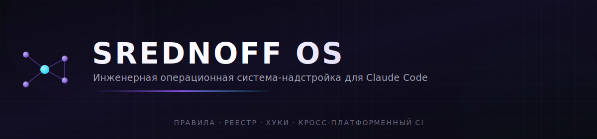
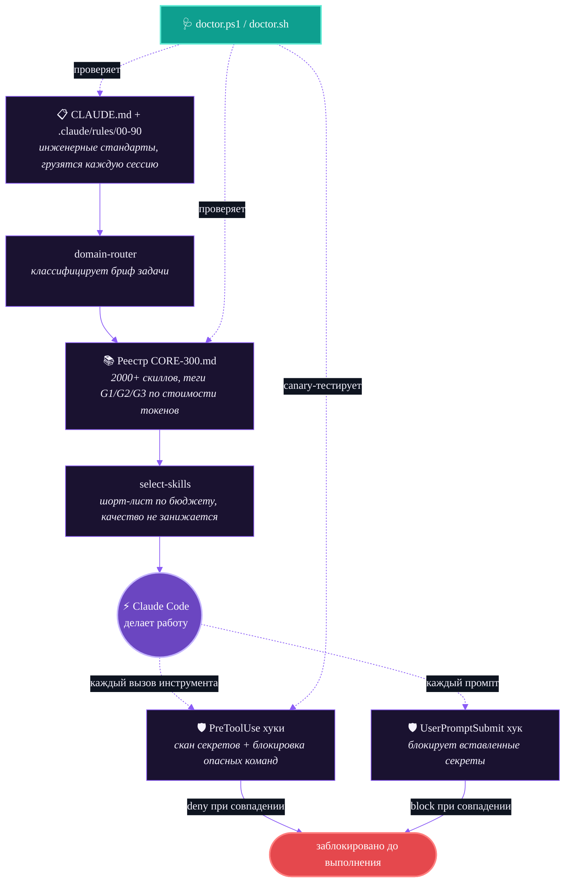

<div align="center">



<br><br>

[](LICENSE)
[](https://github.com/srednoff888-art/srednoff-os-for-claude/actions/workflows/ci.yml)
[](https://claude.com/claude-code)
[](registry/CORE-300.md)
[](https://github.com/srednoff888-art/srednoff-os-for-claude/pulls)

<sub>

[Быстрый старт](#быстрый-старт) &nbsp;•&nbsp; [Как это работает](#как-это-работает) &nbsp;•&nbsp; [Что внутри](#что-внутри) &nbsp;•&nbsp; [Доказательства релиза](#доказательства-релиза) &nbsp;•&nbsp; [Безопасность](#хуки-безопасности--opt-in-намеренно) &nbsp;•&nbsp; [English version ↑](README.md)

</sub>

</div>

<br>

## Проблема

Claude Code сам по себе очень способный инструмент — но каждая сессия начинается с чистого листа. Он заново решает, каких инженерных стандартов придерживаться, не помнит, какой skill реально помог в прошлый раз, и не имеет страховки, если он (или вы) наберёт в терминале что-то опасное.

**SREDNOFF OS — это слой файлов, который это чинит** — правила, которым он следует, реестр из 2000+ скиллов, из которого он выбирает, и хуки, которые остановят его до того, как он сольёт секрет или выполнит `rm -rf`.

<table width="100%">
<tr>
<th align="left" width="26%"></th>
<th align="left" width="37%">Обычный Claude Code</th>
<th align="left" width="37%">+ SREDNOFF OS</th>
</tr>
<tr>
<td><strong>Инженерные стандарты</strong></td>
<td>🔴 Заново решаются каждую сессию</td>
<td>🟢 Грузятся из <code>CLAUDE.md</code> + 10 файлов правил при каждом старте</td>
</tr>
<tr>
<td><strong>Выбор skill'а</strong></td>
<td>🔴 Что модель случайно вспомнит</td>
<td>🟢 Скоринговый шорт-лист из реестра на 2000+ записей, с учётом бюджета</td>
</tr>
<tr>
<td><strong>Вставленные секреты</strong></td>
<td>🔴 Нет встроенной остановки</td>
<td>🟢 Блокируются ещё до отправки промпта</td>
</tr>
<tr>
<td><strong>Опасные команды</strong><br><sub><code>rm -rf</code>, <code>mkfs</code>, force-push…</sub></td>
<td>🔴 Нет встроенной остановки</td>
<td>🟢 Блокируются до выполнения инструмента</td>
</tr>
<tr>
<td><strong>Устанавливаемые скиллы</strong></td>
<td>🔴 Вручную, по одному</td>
<td>🟢 303 курируемых скилла автоустанавливаются по тегам проекта, с капом по бюджету контекста</td>
</tr>
<tr>
<td><strong>Проверка здоровья</strong></td>
<td>🔴 Нет</td>
<td>🟢 Одна команда — структура, evals, аудит реестра, живой canary-тест хуков</td>
</tr>
<tr>
<td><strong>Кросс-платформенность</strong></td>
<td>⚪ Н/Д</td>
<td>🟢 Полный паритет  Windows /  Linux /  macOS — проверено в CI вплоть до bash 3.2</td>
</tr>
</table>

<br>

## 🩻 Как это работает



<br>

## 📦 Что внутри

<table width="100%">
<tr><th align="left" width="42%">Путь</th><th align="left">Содержимое</th></tr>
<tr><td><code>CLAUDE.md</code>, <code>AGENTS.md</code>, <code>code_review.md</code></td><td>Базовый свод правил</td></tr>
<tr><td><code>.claude/rules/00-90</code></td><td>10 пронумерованных файлов правил — выбор скиллов, роутинг моделей, контракт сабагентов…</td></tr>
<tr><td><code>.claude/skills/</code></td><td>Переиспользуемые базовые определения навыков</td></tr>
<tr><td><code>.claude/commands/</code></td><td>Слэш-команды</td></tr>
<tr><td><code>.claude/hooks/</code></td><td>PowerShell + Bash хуки — скан секретов, блокировка опасных команд</td></tr>
<tr><td><code>.agent/</code></td><td>Конвенции для агентов + процесс многоэтапных чекпоинтов</td></tr>
<tr><td><code>scripts/</code></td><td>Установка, doctor, генератор profile-lock, раннер evals, source ranker</td></tr>
<tr><td><code>skills-library/</code></td><td><strong>303 устанавливаемых скилла</strong> — автовыбор по проекту, с капом по бюджету контекста</td></tr>
<tr><td><code>registry/CORE-300.md</code></td><td>2000+ скиллов/агентов, с тегами и уровнями</td></tr>
<tr><td><code>registry/SELECTION-PROTOCOL.md</code></td><td>Как выбирать скиллы под проект, не загружая весь каталог</td></tr>
<tr><td><code>registry/CAPABILITY-INDEX.md</code></td><td>Один канонический выбор на способность — без путаницы дублей</td></tr>
<tr><td><code>registry/evals/</code></td><td>Фикстуры, ловящие регрессии в роутинге и детекции секретов</td></tr>
<tr><td><code>docs/</code></td><td>Архитектура, безопасность, воркфлоу и справочник по валидации</td></tr>
<tr><td><code>benchmarks/</code></td><td>Воспроизводимый бенчмарк control-vs-OS</td></tr>
<tr><td><code>scripts/global/</code></td><td>Опциональный глобальный SessionStart-хук + statusline (opt-in)</td></tr>
</table>

<br>

## 🚀 Быстрый старт

### Вариант A — как плагин Claude Code <sup>(быстрее всего, macOS/Linux)</sup>

Две команды, без копирования файлов и ручной правки `settings.json`:

```
/plugin marketplace add srednoff888-art/srednoff-os-for-claude
/plugin install srednoff-os
```

> Плагин ставится **выключенным** (`defaultEnabled: false`) — его хуки могут блокировать вызовы инструментов, поэтому включаете осознанно через `/plugin`. Авто-подключённые хуки таргетят **bash** и требуют `jq` + `grep -P` в `PATH`. Windows: используйте PowerShell-обёртку из варианта B (одна `hooks.json` не ветвится по ОС).

### Вариант B — per-project скриптами <sup>(Windows-first, вся система)</sup>

Каждый скрипт существует в двух версиях с полным функциональным паритетом:

<table width="100%">
<tr><th align="left" width="26%">Платформа</th><th align="left">Требуется</th></tr>
<tr><td>🪟 <strong>Windows</strong></td><td>PowerShell 5.1+ — без доп. зависимостей</td></tr>
<tr><td>🐧🍎 <strong>Linux / macOS</strong></td><td><code>bash</code> 3.2+ (дефолтный shell macOS работает), <code>jq</code>, <code>grep -P</code> — см. <a href="#примечания">примечания</a> ниже</td></tr>
</table>

```powershell
# Windows
& "path\to\srednoff-os\scripts\init-claude-project.ps1" "C:\path\to\your\project"
```
```bash
# Linux / macOS
bash path/to/srednoff-os/scripts/init-claude-project.sh /path/to/your/project
```

Копирует свод правил в проект, генерирует `.claude/PROFILE.lock.md`, подстроенный под то, что скрипт видит в репозитории (Next.js? Python? торговый/бэктест-код? Amazon FBA?), автоустанавливает капированный тег-совпадающий шорт-лист из библиотеки на 303 скилла, и никогда не перезаписывает уже существующий `CLAUDE.md` — вместо этого делает бэкап и мёржит.

**Проверка здоровья в любой момент:**

```powershell
& "path\to\srednoff-os\scripts\doctor.ps1" -ProjectPath "C:\path\to\your\project" -RunEvals -FixSafe
```
```bash
bash path/to/srednoff-os/scripts/doctor.sh --project /path/to/your/project --run-evals --fix-safe
```

Показывает статус структуры, целостность реестра, валидность каталога/skills-library/доков, процент прохождения evals и гоняет живой canary-тест против ваших хуков безопасности — затем безопасно чинит то, чего не хватает.

<details>
<summary><strong>Как это выглядит, когда OS активна</strong></summary>

```
$ claude
[SREDNOFF OS: ACTIVE] project='my-app' tags=web,frontend,ai rules=10 loaded PROFILE.lock=cached
Principle #1 (quality first, economy only at equal quality). Rules 00-90 loaded: operating-system,
github-research, connectors, user-briefing, quality-gate, security, exec-plans, skills-registry,
model-routing (G1~Haiku/G2~Sonnet/G3~Opus), subagent-contract. Full skill registry on demand
(~/.claude/registry/CORE-300.md). External agents = unvetted until github-research.
```

</details>

<details>
<summary><strong>Глобальный автозапуск (опционально, opt-in)</strong></summary>

<br>

`scripts/global/session-start-hook.{ps1,sh}` и `scripts/global/statusline.{ps1,sh}` можно подключить в `~/.claude/settings.json`, чтобы OS автоматически детектировалась и объявляла о себе в начале каждой сессии внутри рабочего корня, который вы задаёте переменной окружения `SREDNOFF_OS_ROOT` (по умолчанию — домашняя папка, если переменная не задана). Точные ключи `settings.json` — в комментариях самих хуков.

</details>

<br>

## 🔒 Хуки безопасности — opt-in, намеренно

Ничего здесь по умолчанию не меняет ваши глобальные настройки Claude Code. Примеры подключения хуков лежат в `.claude/settings.example.json` — скопируйте нужный блок сами, когда прочитаете, что он делает. Реестр и правила безопасно ставить сразу; хуки, способные блокировать вызовы инструментов, — это то, что стоит включать осознанно.

> ✅ **Проверено в CI, а не просто заявлено.** Каждый push гоняет shellcheck, валидацию JSON, полный eval-suite, hook canary (скармливает каждому хуку заведомо плохой инпут и требует блокировки), валидацию docs/skills-library, синтакс-чек бенчмарк-скрипта и — поскольку macOS поставляет `/bin/bash` 3.2.57 — отдельный job, запускающий реальные security-хуки внутри официального контейнера `bash:3.2`. [Смотреть workflow →](.github/workflows/ci.yml)

<br>

## 📊 Доказательства релиза

| Проверка | Где запускается | Что доказывает |
|---|---|---|
| `shellcheck` | CI (ubuntu) | Каждый `.sh`-файл переносим и корректен |
| `windows-powershell` | CI (windows-latest) | PS-парсинг + PSScriptAnalyzer + полный сьют на флагманской платформе |
| `bash-3-2` | CI (Docker `bash:3.2`) | Именно тот shell, что поставляет macOS — не прокси |
| `hook-canary` + `profile-lock-gate` | CI + `doctor` | Хуки безопасности реально денят/блокируют заведомо плохой инпут |
| `registry-audit` | CI + `doctor` | 0 дублей среди 2000+ записей |
| `skills-library` + `docs` | CI + `doctor` | Все 303 устанавливаемых скилла и доки корректно оформлены |
| `run-evals.{ps1,sh}` | CI + `doctor` | Регресс-сьют роутинга/селектора/секрет-паттернов |

Полная таблица доказательств (каждое число — с командой, которой оно получено, плюс честные секции «чего это не обещает») — в [`QUALITY.md`](QUALITY.md) · текущий статус релиза — в [`RELEASE.md`](RELEASE.md) · воспроизводимый бенчмарк control-vs-OS — в [`benchmarks/`](benchmarks/).

<br>

## 🎯 Главная идея одной строкой

> **Качество решения — первично. Экономия — только tie-breaker.**
> Каждое правило роутинга в этой системе существует, чтобы выбрать *правильный* инструмент под задачу, а не *самый дешёвый* — экономность включается только тогда, когда два варианта дают одинаковый результат.

<br>

## Примечания

- На macOS `grep -P` отсутствует в стоковом BSD `grep`. Поставьте `brew install grep` и задайте `SREDNOFF_GREP_BIN=ggrep`, либо используйте WSL.
- ~569 записей реестра без источника `INST`/`ANTH` — это **непроверенный discovery-список**, а не одобренные-по-лицензии рекомендации — см. верификационный гейт в `70-skills-registry.md` перед тем, как что-то оттуда взять.
- `model-routing` — совет для основной сессии (переключение через `/model`) и реальный параметр per-call для делегированных сабагентов — ничто здесь не переключает модель основной сессии автоматически.

## Контрибьютинг

PR приветствуются. CI гоняет shellcheck, валидацию JSON, полный eval-suite, hook canary, валидацию docs/skills-library и job с реальным контейнером bash-3.2 на каждый push — зелёный CI обязателен. См. [`.github/workflows/ci.yml`](.github/workflows/ci.yml).

## Лицензия

MIT — см. [LICENSE](LICENSE). Используйте, форкайте, урезайте, стройте своё поверх.

<br>

<div align="center">

 Сделано [Ivan Srednoff](https://github.com/srednoff888-art) &nbsp;·&nbsp; [English version](README.md) &nbsp;·&nbsp; [Сообщить о проблеме](https://github.com/srednoff888-art/srednoff-os-for-claude/issues)

</div>
