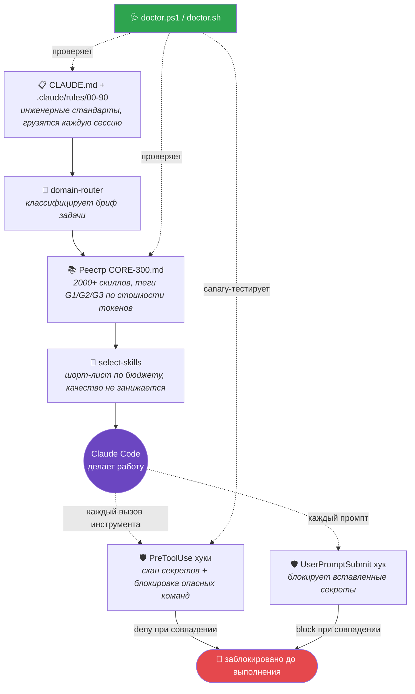

<div align="center">

# 🧠 SREDNOFF OS

### Инженерная операционная система-надстройка для [Claude Code](https://claude.com/claude-code)

Правила, которым он следует. Реестр из 2000+ скиллов, из которого он выбирает. Хуки, которые остановят его до того, как он сольёт секрет или выполнит `rm -rf`.

[](LICENSE)
[](https://github.com/srednoff888-art/srednoff-os-for-claude/actions/workflows/ci.yml)
[](https://claude.com/claude-code)
[](registry/CORE-300.md)
[](scripts/)
[](https://github.com/srednoff888-art/srednoff-os-for-claude/pulls)

[**Быстрый старт**](#быстрый-старт) · [**Как это работает**](#как-это-работает) · [**Что внутри**](#что-внутри) · [English version ↑](README.md)

</div>

<br>

## Проблема

Claude Code сам по себе очень способный инструмент — но каждая сессия начинается с чистого листа. Он заново решает, каких инженерных стандартов придерживаться, не помнит, какой skill реально помог в прошлый раз, и не имеет страховки, если он (или вы) наберёт в терминале что-то опасное.

SREDNOFF OS — это слой файлов, который это чинит.

<table>
<tr><th></th><th>Обычный Claude Code</th><th>+ SREDNOFF OS</th></tr>
<tr><td><strong>Инженерные стандарты</strong></td><td>Заново решаются каждую сессию</td><td>Грузятся из <code>CLAUDE.md</code> + 10 файлов правил при каждом старте</td></tr>
<tr><td><strong>Выбор skill'а</strong></td><td>Что модель случайно вспомнит</td><td>Скоринговый шорт-лист из реестра на 2000+ записей, с учётом бюджета</td></tr>
<tr><td><strong>Вставленные секреты</strong></td><td>Нет встроенной остановки</td><td>Блокируются ещё до отправки промпта</td></tr>
<tr><td><strong>Опасные команды</strong> (<code>rm -rf</code>, <code>mkfs</code>, force-push…)</td><td>Нет встроенной остановки</td><td>Блокируются до выполнения инструмента</td></tr>
<tr><td><strong>Проверка здоровья</strong></td><td>Нет</td><td>Одна команда: структура + evals + живой canary-тест хуков</td></tr>
<tr><td><strong>Кросс-платформенность</strong></td><td>Н/Д</td><td>Полный паритет Windows / Linux / macOS — проверено в CI вплоть до bash 3.2</td></tr>
</table>

<br>

## 🩻 Как это работает



<br>

## 📦 Что внутри

```text
CLAUDE.md, AGENTS.md, code_review.md   базовый свод правил
.claude/rules/00-90                    10 пронумерованных файлов правил — выбор скиллов, роутинг моделей, контракт сабагентов...
.claude/skills/                        переиспользуемые определения навыков
.claude/commands/                      слэш-команды
.claude/hooks/                         PowerShell + Bash хуки — скан секретов, блокировка опасных команд
.agent/                                конвенции для агентов
scripts/                               установка, doctor, генератор profile-lock, раннер evals
registry/CORE-300.md                   2000+ скиллов/агентов, с тегами и уровнями
registry/SELECTION-PROTOCOL.md         как выбирать скиллы под проект, не загружая весь каталог
registry/CAPABILITY-INDEX.md           один канонический выбор на способность — без путаницы дублей
registry/evals/                        фикстуры, ловящие регрессии в роутинге и детекции секретов
scripts/global/                        опциональный глобальный SessionStart-хук + statusline (opt-in)
```

<br>

## 🚀 Быстрый старт

### Вариант A — как плагин Claude Code <sup>(быстрее всего, macOS/Linux)</sup>

Две команды, без копирования файлов и ручной правки `settings.json`:

```
/plugin marketplace add srednoff888-art/srednoff-os-for-claude
/plugin install srednoff-os
```

> Плагин ставится **выключенным** (`defaultEnabled: false`) — его хуки могут блокировать вызовы инструментов, поэтому включаете осознанно через `/plugin`. Авто-подключённые хуки таргетят **bash** и требуют `jq` + `grep -P` в `PATH`. Windows: используйте PowerShell-обёртку из варианта B (одна `hooks.json` не ветвится по ОС).

### Вариант B — per-project скриптами <sup>(Windows-first, вся система)</sup>

Каждый скрипт существует в двух версиях с полным функциональным паритетом:

| Платформа | Требуется |
|---|---|
| **Windows** | PowerShell 5.1+ — без доп. зависимостей |
| **Linux / macOS** | `bash` 3.2+ (дефолтный shell macOS работает), `jq`, `grep -P` — см. [примечания](#примечания) ниже |

```powershell
# Windows
& "path\to\srednoff-os\scripts\init-claude-project.ps1" "C:\path\to\your\project"
```
```bash
# Linux / macOS
bash path/to/srednoff-os/scripts/init-claude-project.sh /path/to/your/project
```

Копирует свод правил в проект, генерирует `.claude/PROFILE.lock.md`, подстроенный под то, что скрипт видит в репозитории (Next.js? Python? торговый/бэктест-код? Amazon FBA?), и никогда не перезаписывает уже существующий `CLAUDE.md` — вместо этого делает бэкап и мёржит.

**Проверка здоровья в любой момент:**

```powershell
& "path\to\srednoff-os\scripts\doctor.ps1" -ProjectPath "C:\path\to\your\project" -RunEvals -FixSafe
```
```bash
bash path/to/srednoff-os/scripts/doctor.sh --project /path/to/your/project --run-evals --fix-safe
```

Показывает статус структуры, целостность реестра, процент прохождения evals и гоняет живой canary-тест против ваших хуков безопасности — затем безопасно чинит то, чего не хватает.

<details>
<summary><strong>Как это выглядит, когда OS активна</strong></summary>

```
$ claude
SREDNOFF OS ACTIVE in project 'my-app'. Operating rules: Principle #1 (quality first,
economy only at equal quality); rules 00-90 loaded (github-research, quality-gate,
security, exec-plans, skills-registry, model-routing G1~Haiku/G2~Sonnet/G3~Opus,
subagent-contract). PROFILE.lock [tags: web, frontend, ai]. Full skill registry
available on demand. External agents = unvetted until github-research.
```

</details>

<details>
<summary><strong>Глобальный автозапуск (опционально, opt-in)</strong></summary>

<br>

`scripts/global/session-start-hook.{ps1,sh}` и `scripts/global/statusline.{ps1,sh}` можно подключить в `~/.claude/settings.json`, чтобы OS автоматически детектировалась и объявляла о себе в начале каждой сессии внутри рабочего корня, который вы задаёте переменной окружения `SREDNOFF_OS_ROOT` (по умолчанию — домашняя папка, если переменная не задана). Точные ключи `settings.json` — в комментариях самих хуков.

</details>

<br>

## 🔒 Хуки безопасности — opt-in, намеренно

Ничего здесь по умолчанию не меняет ваши глобальные настройки Claude Code. Примеры подключения хуков лежат в `.claude/settings.example.json` — скопируйте нужный блок сами, когда прочитаете, что он делает. Реестр и правила безопасно ставить сразу; хуки, способные блокировать вызовы инструментов, — это то, что стоит включать осознанно.

> ✅ **Проверено в CI, а не просто заявлено.** Каждый push гоняет shellcheck, валидацию JSON, полный eval-suite, hook canary (скармливает каждому хуку заведомо плохой инпут и требует блокировки) и — поскольку macOS поставляет `/bin/bash` 3.2.57 — отдельный job, запускающий реальные security-хуки внутри официального контейнера `bash:3.2`. [Смотреть workflow →](.github/workflows/ci.yml)

<br>

## 🎯 Главная идея одной строкой

> **Качество решения — первично. Экономия — только tie-breaker.**
> Каждое правило роутинга в этой системе существует, чтобы выбрать *правильный* инструмент под задачу, а не *самый дешёвый* — экономность включается только тогда, когда два варианта дают одинаковый результат.

<br>

## Примечания

- На macOS `grep -P` отсутствует в стоковом BSD `grep`. Поставьте `brew install grep` и задайте `SREDNOFF_GREP_BIN=ggrep`, либо используйте WSL.
- ~569 записей реестра без источника `INST`/`ANTH` — это **непроверенный discovery-список**, а не одобренные-по-лицензии рекомендации — см. верификационный гейт в `70-skills-registry.md` перед тем, как что-то оттуда взять.
- `model-routing` — совет для основной сессии (переключение через `/model`) и реальный параметр per-call для делегированных сабагентов — ничто здесь не переключает модель основной сессии автоматически.

## Контрибьютинг

PR приветствуются. CI гоняет shellcheck, валидацию JSON, полный eval-suite, hook canary и job с реальным контейнером bash-3.2 на каждый push — зелёный CI обязателен. См. [`.github/workflows/ci.yml`](.github/workflows/ci.yml).

## Лицензия

MIT — см. [LICENSE](LICENSE). Используйте, форкайте, урезайте, стройте своё поверх.

<br>

<div align="center">

Сделано [Ivan Srednoff](https://github.com/srednoff888-art) · [English version](README.md) · [Сообщить о проблеме](https://github.com/srednoff888-art/srednoff-os-for-claude/issues)

</div>
