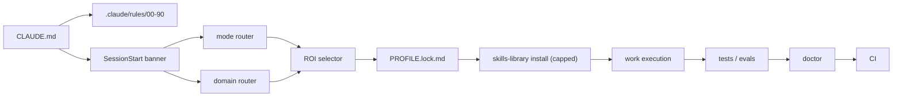
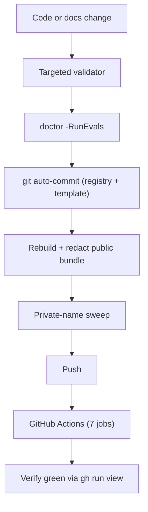

# Architecture

SREDNOFF OS is a portable operating layer for Claude Code. It's split into a compact
always-loaded core, scriptable routers/selectors, on-demand skill reads, and validation
gates - the same shape as srednoff-os (the Codex sibling), rewritten for Claude Code's
actual mechanisms (native `.claude/rules/`, hooks with a real deny contract, Skills).

## System Map

## Ownership Boundaries

| Layer | Files | Loaded by default |
|---|---|---|
| Entrypoint | `CLAUDE.md` | Yes, every session |
| Core rules | `.claude/rules/00-90` (10 files) | Yes, every session - cross-cutting, no `paths:` scoping |
| Project-added rules | `.claude/rules/*` beyond 00-90 | Only when `paths:` glob matches the file being touched (native Claude Code feature) |
| Skill definitions (base) | `.claude/skills/*/SKILL.md` (5) | Auto-discovered, name+description scanned at session start |
| Skill library (curated, 303) | `templates/claude-md-os/skills-library/*/SKILL.md` | No - `gen-profile-lock` installs a capped, tag-matched subset into a project's `.claude/skills/` |
| Text catalog (~1700 records) | `registry/CORE-300.md` | No - grep/reference only, no installable content |
| Machine-readable catalog export | `registry/CORE-300.json` | No - for external tools, not Claude Code itself |
| Hooks | `.claude/hooks/*.ps1`, `*.sh` | Only if wired into `settings.json` (opt-in) |
| Registry scripts | `registry/*.ps1`, `*.sh` | Called by rules/hooks/doctor, not auto-loaded |
| Local state | `~/.claude/logs/*`, session-state | User machine, never committed |

## Startup Flow

1. `CLAUDE.md` + `.claude/rules/00-90` load automatically every session.
2. If `.claude/PROFILE.lock.md` exists, it's the cached, project-specific starting
   selection - read it first (enforced by the `require-profile-lock-read` hook when
   active, not just a prose instruction; see [security.md](security.md)).
3. For substantial work, `mode-router` classifies quality mode (fast/standard/
   production/critical/turbo) and `domain-router` classifies task domain.
4. `select-skills` runs an ROI-scored selection from `CORE-300.md` against the budget
   the mode implies.
5. Claude reads only the selected `SKILL.md` files - the ~1700-record text catalog and
   the 4500-style synthetic-kernel approach some sibling systems use are both avoided;
   loading the whole catalog into context on every session is treated as a bug, not a
   feature.

## Skills-Library Install vs Text Catalog

Most of `CORE-300.md` is reference text: grep it, read the relevant lines, apply the
pattern manually. A curated subset (303 records, source `SREDNOFF`, see
`registry/INSTALL-SOURCES.md`) has real `SKILL.md` content in `skills-library/` and gets
**installed** - copied into a project's `.claude/skills/` by `gen-profile-lock`, capped at
20 per project (Claude Code scans name+description for every installed skill at session
start, roughly 100 tokens each even when unused - installing all 303 unconditionally
would cost 30k+ tokens per session for no benefit).

## Release Evidence Path

Every checkpoint in this project's history is auditable through files, local doctor
output, and a real GitHub Actions run - not just narrated. See
[validation.md](validation.md) for the exact check list and [workflows.md](workflows.md)
for the release cycle this diagram summarizes.
